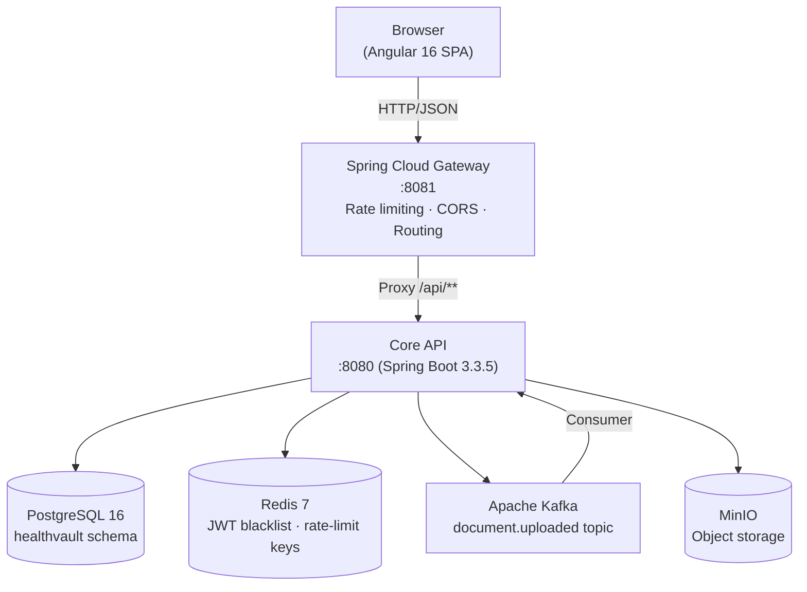

# Health Vault

A personal health record vault — upload medical documents, extract metrics automatically, and visualise trends over time. Built end-to-end across 9 phases as a full-stack reference project.

---

## Architecture



**Single-tier, single-region.** No microservice split — the Spring Boot monolith owns auth, metrics, documents, and ingestion. The gateway handles rate-limiting and CORS so those concerns stay out of application code.

---

## Tech Stack

| Layer | Technology | Version |
|-------|-----------|---------|
| Frontend | Angular (standalone components) | 16.x |
| API Gateway | Spring Cloud Gateway (WebFlux) | 2023.0.3 |
| Backend | Spring Boot + Spring Security | 3.3.5 |
| Language | Java | 17 |
| Database | PostgreSQL | 16-alpine |
| Schema migrations | Flyway | (Boot-managed) |
| Cache / blacklist | Redis | 7-alpine |
| Message bus | Apache Kafka | 7.6.0 (Confluent) |
| Object storage | MinIO | RELEASE.2024-07-04 |
| Container runtime | Docker + docker-compose | — |
| Build (Java) | Maven | 3.9 |
| Build (frontend) | Angular CLI + Nginx | 1.27-alpine |

---

## Key Design Decisions

| Decision | Rationale |
|----------|-----------|
| **Monolith over microservices** | Simpler local dev, fewer network hops, lower operational complexity for a single-team project |
| **Spring Cloud Gateway as a separate process** | Rate limiting needs Redis-backed state; decoupling from the monolith means the gateway can be scaled or replaced without touching business code |
| **JWT + opaque refresh tokens** | Short-lived JWTs (15 min) reduce revocation cost; opaque refresh tokens stored as SHA-256 hashes prevent token leakage if DB is read-only compromised |
| **Refresh token rotation** | Old token revoked on every use — a reused token is a signal of theft |
| **Apache Tika for MIME detection** | Client-supplied `Content-Type` is untrusted; Tika reads magic bytes to confirm the file is what it claims to be |
| **AES-256-GCM for filename encryption** | Filenames can reveal diagnoses (e.g. `brain_mri_2025.pdf`); GCM provides authenticated encryption with a fresh IV per call |
| **Kafka for ingestion decoupling** | Upload succeeds instantly; OCR + metric extraction runs asynchronously — upload latency is not coupled to Tesseract processing time |
| **Fail-open on Kafka and Redis** | If Kafka is unreachable, the upload still succeeds (document stays UPLOADED). If Redis is unreachable, logout still revokes the refresh token in DB; rate-limiting fails open. Trade-off: availability over strict consistency. |
| **JaCoCo + Testcontainers** | Real container-backed integration tests catch DB schema drift, Kafka offset behaviour, and MinIO permission issues that mocks miss |
| **Actuator/prometheus behind auth (A05 fix)** | `/actuator/health/**` is public (healthchecks); all other actuator endpoints require authentication to prevent unauthenticated metric scraping |

---

## Project Phases

| Phase | Deliverable |
|-------|-------------|
| 0 | Scaffold: Spring Boot + Angular + Docker Compose |
| 1 | Auth: JWT + opaque refresh tokens + Redis blacklist |
| 2 | Health metrics: CRUD + PostgreSQL JSONB + JPA |
| 3 | Dashboard API: DashboardService + JdbcTemplate + Redis cache |
| 4 | Document upload: MinIO + Apache Tika + file size/MIME validation |
| 5 | Ingestion pipeline: Kafka producer/consumer + OCR (Tesseract) + metric extraction |
| 6 | API Gateway: Spring Cloud Gateway + Redis rate limiting + CORS |
| 7 | Observability: Micrometer + Zipkin + structured logging (Logstash) + audit log |
| 8 | Testing: Unit (Mockito/Jasmine) + Integration (Testcontainers) + E2E (Playwright) + CI pipeline |
| 9 | Security & hardening: OWASP self-review + dependency scan + k6 load test + A05 fix + README |

---

## Local Setup

### Prerequisites

- Docker Desktop (or equivalent)
- Java 17 + Maven 3.9 (for backend development)
- Node 20 + npm (for frontend development)
- k6 (optional, for load testing)

### Start the full stack

```bash
# From the repo root
docker compose -f infra/docker/docker-compose.yml up -d

# Verify all services healthy
docker compose -f infra/docker/docker-compose.yml ps
```

Services start on:

| Service | URL |
|---------|-----|
| Angular SPA | http://localhost:4200 (dev server) |
| Spring Cloud Gateway | http://localhost:8081 |
| Core API (direct) | http://localhost:8080 |
| MinIO Console | http://localhost:9001 (minioadmin / minioadmin) |
| Kafka UI | — (no UI container; use `kafka-console-consumer`) |

### Run backend only (dev mode)

```bash
cd backend
mvn spring-boot:run -Dspring-boot.run.profiles=local
```

### Run frontend only (dev mode)

```bash
cd frontend
npm install
npm start
# Opens http://localhost:4200
```

---

## Testing

### Backend unit tests

```bash
cd backend
mvn test
# JaCoCo report: target/site/jacoco/index.html
```

### Backend integration tests (requires Docker)

```bash
cd backend
mvn verify -Dsurefire.excludedGroups=integration -Dfailsafe.groups=integration
```

### Gateway unit tests

```bash
cd gateway
mvn test
```

### Frontend unit tests

```bash
cd frontend
npm test                  # interactive (watch mode)
npm run test:coverage     # single run + coverage report
```

### End-to-end tests (Playwright)

```bash
# Requires full stack running (docker compose up -d)
cd frontend
npm run e2e
```

### Load test (k6)

```bash
# Requires docker compose up -d and k6 installed
TOKEN=$(curl -s -X POST http://localhost:8081/api/auth/login \
  -H 'Content-Type: application/json' \
  -d '{"email":"load@test.com","password":"LoadTest123!"}' | jq -r .accessToken)

TOKEN=$TOKEN k6 run docs/k6-load-test.js
```

See `docs/load-test-results.md` for threshold definitions and expected behaviour.

---

## CI Pipeline

`.github/workflows/ci.yml` runs 8 jobs on every push:

| Job | When | What |
|-----|------|------|
| `backend-unit` | Always | `mvn test` + JaCoCo |
| `gateway-unit` | Always | `mvn test` + JaCoCo |
| `frontend-unit` | Always | Karma/Jasmine + coverage |
| `frontend-build` | After unit | `ng build --configuration=production` |
| `backend-integration` | After unit | Testcontainers (Postgres + Kafka + Redis + MinIO) |
| `security` | After unit | npm audit (critical) + OWASP Dependency-Check |
| `docker-images` | After integration + build | `docker build` all three images (no push) |
| `compose-smoke` | After docker-images | Full stack boot + curl smoke tests |

Registry push is commented out in the workflow. Configure `DOCKER_USERNAME` / `DOCKER_PASSWORD` secrets and uncomment to enable.

---

## Security Posture

Full details: `docs/owasp-review.md`

### OWASP Top 10 (2021)

| Category | Status |
|----------|--------|
| A01 Broken Access Control | PASS — userId always from JWT, not client input |
| A02 Cryptographic Failures | PASS — AES-256-GCM (fresh IV), BCrypt, SHA-256 refresh tokens |
| A03 Injection | PASS — JPA parameterized queries; Tika MIME; extension sanitized |
| A04 Insecure Design | PASS — token rotation, blacklisting, rate limiting |
| A05 Security Misconfiguration | **Fixed** — actuator auth applied (A05-001) |
| A06 Vulnerable Components | Scanned — see `docs/dependency-scan-results.md` |
| A07 Auth Failures | PASS — BCrypt, rate limit, JWT validation, blacklist on logout |
| A08 Data Integrity | PASS — Tika magic-byte validation + MIME allowlist |
| A09 Logging/Monitoring | PASS — audit log for all auth + document events |
| A10 SSRF | PASS — no user-controlled URL fetching |

### Dependency scan

- **Java:** OWASP Dependency-Check plugin wired (`-Ddependency-check.skip=false` to run)
- **npm:** 58 vulnerabilities, all in dev dependencies or Angular 16.x framework locked at 16.x. No exploitable paths in this architecture. Details and accept-risk rationale in `docs/dependency-scan-results.md`.
- **Dependabot:** `.github/dependabot.yml` sends weekly PRs for Maven + npm + Docker updates

---

## Roadmap

| Item | Priority |
|------|----------|
| Replace single-key AES with KMS-backed key management (AWS KMS / HashiCorp Vault) | High |
| Enable MinIO server-side encryption at rest in production | High |
| Configure CORS for production origins (not localhost) | High (pre-deploy blocker) |
| Upgrade Angular 16.x → 18.x (LTS) when team bandwidth allows | Medium |
| Add account lockout after N failed logins (complement rate limiting) | Medium |
| Export audit log to centralised SIEM (Splunk / ELK) | Medium |
| Add k6 load test results once live stack is available | Low |
| Prometheus alerting rules for `auth.login.count{outcome="failure"}` spike | Low |
