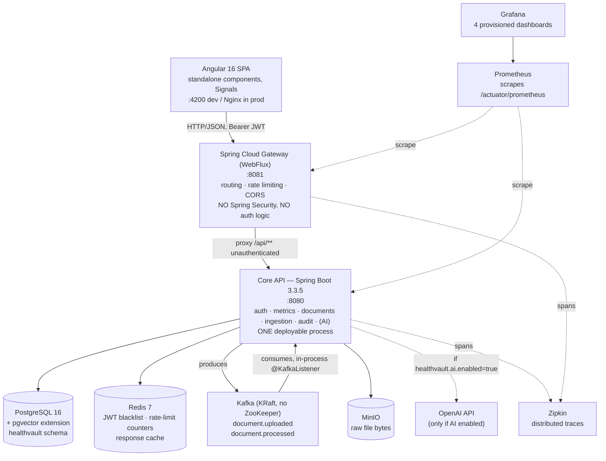

# Health Vault — Learning Guide

This is a code-level teaching document. It is not the README (how to run the project) and not
`PROGRESS.md` (a phase-by-phase decisions log). It exists so that you — returning to this project
cold, or someone seeing it for the first time — can actually understand *what's here, why it's
built this way,* and defend it under questioning.

Everything below was verified against the code as it exists right now (2026-08-23), not against
the original phase prompts. Where the code drifted from what a phase prompt originally asked for,
or where the README's own diagram is stale, that is called out explicitly rather than silently
copied.

---

## 1. Orientation — the 5-minute mental model

**What it does.** Health Vault is a personal health record vault. A user uploads medical
documents (lab reports, prescriptions, scans), the system OCRs them and auto-extracts structured
metrics (blood pressure, glucose, weight, heart rate, workouts) via regex, and the user can also
enter metrics manually. A dashboard aggregates and charts trends over time. An optional AI layer
(off by default) can summarize a document, answer questions about a user's own records via RAG,
and narrate metric trends in plain English.

**The real, as-built shape of the system.** The README's Mermaid diagram is stale — it omits
Prometheus, Grafana, Zipkin, and the Redis exporter entirely (all real containers in
`infra/docker/docker-compose.yml`), and shows only the `document.uploaded` Kafka topic when a
second topic, `document.processed`, also exists and is actively used. The corrected picture:



**Separate deployables vs. packages in one process — the distinction that matters most:**

- **Two real deployables**: the Gateway (`gateway/`, Spring Cloud Gateway, WebFlux, reactive) and
  the Core API (`backend/`, Spring Boot MVC, servlet). Everything else — auth, metrics, documents,
  the async ingestion pipeline, audit logging, and the optional AI layer — is **one Spring Boot
  process**. "Async ingestion worker" is not a separate service; it's a `@KafkaListener` bean
  (`DocumentUploadedConsumer`) running inside Core API's own JVM, consuming from the same Kafka
  broker Core API produces to. There is no separately deployed worker to scale independently.
- The **Gateway has no Spring Security dependency at all** (confirmed: no
  `spring-security-*` artifact in `gateway/pom.xml`, no `SecurityConfig` class anywhere in the
  module). It does routing, Redis-backed rate limiting, and CORS — nothing that inspects a JWT's
  signature. All real authentication and authorization happen in Core API.
- Infra containers (Postgres, Redis, Kafka, MinIO, Prometheus, Grafana, Zipkin, a Redis exporter)
  are declared in `infra/docker/docker-compose.yml`; Core API and Gateway themselves are **not**
  containerized in that file by design (a comment there says so explicitly) — they run on the host
  via `mvn spring-boot:run` in local dev. A second file, `docker-compose.ci.yml`, is an overlay
  that *does* containerize all three app images, used only in CI.

**The 3 patterns that repeat everywhere — learn these before anything else:**

1. **`userId` always comes from the validated JWT subject, never from client input.** Every
   controller extracts `UUID.fromString(auth.getName())` (or the JWT `sub` claim) and every service
   method takes that `userId` as an explicit parameter used in every repository lookup
   (`findByIdAndUserIdAndDeletedAtIsNull(id, userId)`). A request for someone else's resource
   returns 404, never 403 — the app never confirms a resource exists for another user.
2. **Sensitive fields are encrypted via one shared `EncryptionService` before they touch
   PostgreSQL** — document filenames, OCR-extracted text, AI-generated summaries, and RAG chunk
   text are all AES-256-GCM ciphertext in the DB, decrypted only at read time. The raw file bytes
   in MinIO are *not* application-layer encrypted (that relies on MinIO/S3 server-side encryption,
   which is off in local dev) — encryption here is specifically for PostgreSQL metadata.
3. **Fail-open by default, fail-closed only where a comment explicitly says otherwise.** Kafka
   unreachable → upload still succeeds. Redis unreachable → rate limiting and JWT-blacklist checks
   silently no-op. Audit-log write failure → the primary action (login, metric create, document
   delete) still succeeds. This is a deliberate, repeatedly-commented availability-over-strict-
   consistency trade-off — and `AuditService.java` explicitly flags it as the one most likely to
   need flipping in a regulated (HIPAA/SOC2) environment.

---

## 2. Tech stack — what's used and why

| Technology | Where | Why (from code/docs) or honest gap |
|---|---|---|
| Spring Boot 3.3.5 / Java 17 | Core API | Baseline; no rationale comment beyond being the current LTS pairing at project start |
| Spring Cloud Gateway 2023.0.3 (WebFlux) | Gateway | README: "decoupling from the monolith means the gateway can be scaled or replaced without touching business code" — also needs Redis-backed reactive rate limiting |
| Angular 16.x, standalone components | Frontend | No comment justifies standalone-over-NgModule specifically; the whole app has zero `*.module.ts` files, a consistent implicit choice |
| Angular Signals over NgRx | Frontend state | **Never explicitly justified anywhere in the repo** — NgRx is never even mentioned. The pattern (`private _user = signal(...)`, public `computed()`/`asReadonly()` views) is simply how state was built from the start. Say so honestly rather than inventing a rationale. |
| PostgreSQL 16 + JSONB `value` column on `health_metrics` | Schema | `V3__health_metrics.sql` comment: *"metric_type VARCHAR + CHECK keeps the DB human-readable and extensible without another migration when a new type is added."* That comment is about `metric_type` being VARCHAR+CHECK rather than a native enum — there is no comment specifically weighing JSONB-for-`value` against per-type columns, though the same extensibility logic plainly applies (a new metric type needs zero schema migration either way). Flagged here as inferred, not quoted, for the `value` column specifically. |
| pgvector extension, HNSW index | AI embeddings | `V8__ai_pgvector.sql`: HNSW chosen "over IVFFlat: better recall at query time and no training step needed... impractical for incremental document ingestion" |
| Redis 7 | JWT blacklist, rate-limit counters, response cache | Needed as shared state across Gateway + Core API instances; also backs `@Cacheable` for dashboard/AI-summary/AI-trend caches |
| Kafka (Confluent 7.6, KRaft, no ZooKeeper) | Upload → ingestion decoupling | README: "Upload succeeds instantly; OCR + metric extraction runs asynchronously — upload latency is not coupled to Tesseract processing time" |
| MinIO | Raw file bytes | S3-compatible, self-hostable for local dev; presigned URLs for download without proxying bytes through Core API |
| Apache Tika (core + parsers) | MIME sniffing, OCR text extraction | README: "Client-supplied Content-Type is untrusted; Tika reads magic bytes to confirm the file is what it claims to be." For OCR, Tika delegates to Tesseract for image-only content if installed; PDFBox (bundled in Tika) extracts embedded PDF text natively |
| Spring-native JWT (`spring-security-oauth2-jose` + Nimbus) over an external JWT library | Auth | `pom.xml` comment: "avoids pulling in an external JWT library and ensures the version is always in sync with the Spring Security release train" |
| AES-256-GCM, single static key | Field-level encryption | README: "Filenames can reveal diagnoses (e.g. `brain_mri_2025.pdf`); GCM provides authenticated encryption with a fresh IV per call." Explicitly a placeholder for a future KMS — see §7 |
| JWT access token (15 min) + opaque SHA-256-hashed refresh token, with rotation | Session model | README: "Short-lived JWTs reduce revocation cost; opaque refresh tokens stored as SHA-256 hashes prevent token leakage if DB is read-only compromised" and "Old token revoked on every use — a reused token is a signal of theft" |
| `localStorage` for both tokens (frontend) | Session storage | `PROGRESS.md`: *"Simpler for Phase 1; httpOnly cookies deferred"* and, more bluntly, *"Vulnerable to XSS. httpOnly cookie approach (more secure) deferred."* — an honestly admitted trade-off, not a defended one |
| JUnit/Mockito (unit) + Testcontainers (integration) + Playwright (E2E) | Testing | README: "Real container-backed integration tests catch DB schema drift, Kafka offset behaviour, and MinIO permission issues that mocks miss" |
| Micrometer + Prometheus + Grafana + Zipkin (OTel bridge) | Observability | Standard Spring Boot 3 idiomatic stack; OTel bridge "also enables... traceId appears in MDC for every request automatically" (pom.xml comment) |
| Spring AI 1.0.0 (OpenAI) | Optional AI layer | Non-starter dependency "to avoid autoconfiguration on startup" (pom.xml comment) — the whole AI bean graph is gated behind `@ConditionalOnProperty(healthvault.ai.enabled)` so it's structurally absent, not just inactive, when off |

---

## 3. Package-by-package / module-by-module tour

### 3.1 Core API — `com.healthvault.auth`

Owns user accounts, JWT issuance/validation, refresh-token rotation, and logout blacklisting.

- **`entity.User`** — id/email/passwordHash (BCrypt)/fullName. Nothing unusual.
- **`entity.RefreshToken`** — stores only a **SHA-256 hash** of the raw refresh token
  (`TokenService.hashToken`), never the raw value, plus `revoked`/`expiresAt`. A stolen DB dump
  cannot be used to forge sessions.
- **`service.TokenService`** — the JWT and blacklist mechanics, worth whiteboarding in full:
  - `generateAccessToken`: builds a `JwtClaimsSet` with `subject=userId`, a random `jti` (JWT ID),
    15-minute expiry, signed HS256 via `JwtEncoder` (Nimbus, configured in `auth.config.JwtConfig`
    from a `>= 32-char` secret).
  - `blacklist(jwt)`: on logout, writes `blacklist:jti:<jti>` into Redis with a TTL equal to the
    **token's remaining lifetime** (not a fixed TTL) — so the blacklist entry disappears exactly
    when the token would have expired anyway, never leaking memory.
  - `isBlacklisted(jwt)`: checked on every authenticated request by `JwtAuthenticationFilter`.
    Both `blacklist()` and `isBlacklisted()` **fail open** on Redis errors — a logged-out token
    remains technically valid until natural expiry if Redis is down, but the refresh token is
    still revoked in Postgres regardless, so a full new session can't be minted.
  - `generateRefreshTokenRaw()`: 32 cryptographically random bytes, hex-encoded — an opaque token,
    unrelated to the JWT structure.
- **`filter.JwtAuthenticationFilter`** (`OncePerRequestFilter`) — the actual auth enforcement
  point. No `Authorization: Bearer` header → falls through, letting Spring Security's authorization
  rules decide (public paths pass, everything else 401s via the custom entry point). A present
  header is decoded (`JwtException` → 401 "Invalid or expired token"), then checked against the
  blacklist (401 "Token has been revoked" if hit). On success, sets a
  `UsernamePasswordAuthenticationToken` whose **principal is the raw user UUID string** — this is
  why every controller does `UUID.fromString(auth.getName())` rather than looking up a richer
  principal object.
- **`filter.RateLimitFilter`** — fixed-window Redis counter (`INCR` + `EXPIRE` on first hit) keyed
  `rate_limit:{login|register}:{clientIp}:{windowBucket}`, applied only to
  `/api/auth/{login,register}`, before the JWT filter in the chain. Fails open on Redis errors.
  This is a *second*, independent rate limiter from the Gateway's Redis token-bucket — either can
  trip first, and both target the same two endpoints.
- **`service.AuthService`** — register (409 on duplicate email, deliberately generic message to
  avoid confirming which field conflicted), login (same generic 401 whether the email doesn't
  exist or the password is wrong — no user enumeration), refresh (rotation: old token revoked in
  the same transaction that issues the new pair), logout (blacklists the JWT + revokes the refresh
  token, wrapped in try/catch so a malformed/expired access token at logout time doesn't prevent
  the refresh-token revocation from completing).
- **`controller.AuthController`** / **`UserController`** — thin; all logic lives in the service
  layer. `UserController.me()` is the one place a controller talks to a repository directly rather
  than through a service — a minor inconsistency, not a bug.

### 3.2 `com.healthvault.metrics`

Health metric CRUD, JSONB value validation, and the dashboard aggregation query.

- **`entity.HealthMetric`** — `value` is `Map<String,Object>` mapped via
  `@JdbcTypeCode(SqlTypes.JSON)` to a `jsonb` column. `PROGRESS.md` records *why* this specific
  Hibernate annotation and not a custom `@Converter`: a plain `@Convert` serializes to a JDBC
  `varchar`, and "PostgreSQL 42.7.4 JDBC won't auto-cast varchar→jsonb" — `SqlTypes.JSON` sends the
  correct JDBC type. (`JsonMapConverter`, an `AttributeConverter`, still exists in the codebase but
  is superseded by this annotation on the entity — worth noting as a small case of "two ways to do
  the same thing, only one currently wired.")
- **`service.MetricValidationService`** — the single source of truth for each metric type's exact
  `value` shape and numeric ranges (systolic 60–300, diastolic 40–200 and must be less than
  systolic, glucose 10–1000 mg/dL with a FASTING/POST_MEAL/RANDOM context enum-as-string, weight
  1–500 kg, workout duration 1–600 min with LOW/MODERATE/HIGH intensity, heart rate 20–300 bpm).
  This exact class is reused, unmodified, by the async ingestion pipeline (`IngestionService`)
  before it persists a regex-extracted metric — one validation rulebook for both manual entry and
  auto-extraction.
- **`service.DashboardService`** — bypasses JPA entirely and hand-writes parameterized SQL via
  `JdbcTemplate`, because the aggregation (`date_trunc` + `AVG`/`MIN`/`MAX` over a JSONB field cast
  to numeric, e.g. `(value->>'systolic')::numeric`) has no natural JPQL/Criteria expression. The
  SQL text itself is built with `String.formatted()` interpolating `trunc` (from the
  `DashboardGranularity` enum: `day`/`week`/`month`, never client-supplied text) and a hardcoded
  literal field name selected by a `switch` on `MetricType` — **not** user input, so despite the
  string formatting this is not a SQL-injection vector; only the `?`-bound `userId`/`type`/
  date-range values come from the request. Results are cached via `@Cacheable("dashboard")`, keyed
  on `userId + type + fromDate + toDate + granularity`, evicted on any metric create/update/delete
  for that user (`@CacheEvict(allEntries = true)` — a blunt full-cache-clear rather than a
  targeted per-user eviction, a simplicity-over-precision trade-off).
- **`repository.MetricSpecifications`** — small `Specification<HealthMetric>` composables
  (`forUser`, `notDeleted`, `byType`, date-range) used by `HealthMetricService.findAll` to build
  the filtered/paginated list query declaratively.

### 3.3 `com.healthvault.documents`

Upload, storage, and lifecycle of user documents.

- **`entity.Document`** — `encryptedFilename` (BYTEA, AES-256-GCM), `storageKey` (server-generated
  `{userId}/{uuid}.{ext}`, never derived from or exposing the client's filename), `status`
  (`UPLOADED → PROCESSING → PROCESSED|FAILED`), soft-delete via `deletedAt`.
- **`service.DocumentService.upload()`** — the full upload path in order: reject empty file →
  reject if `file.getSize() > docProps.maxSizeBytes()` (25MB default) → Tika `detect()` on the
  actual bytes (never the client `Content-Type`) → reject if not in the MIME allowlist
  (pdf/jpeg/png) → generate the opaque storage key → AES-256-GCM-encrypt the original filename →
  stream to MinIO (`file.getInputStream()`, which reads from the temp file Spring's multipart
  handling already spooled to disk) → persist the `Document` row → **fire-and-forget** a
  `document.uploaded` Kafka event (catch-all try/catch; a failure here only logs a warning — the
  upload has already succeeded and committed).
- **`service.DocumentService.delete()`** — soft-deletes the DB row but hard-deletes the MinIO
  object, and proceeds with the soft-delete even if the MinIO removal throws. Comment explains the
  asymmetry directly: keep the DB row as an audit trail ("a document existed") without retaining
  the actual sensitive bytes indefinitely.
- **`DocumentMapper`** — the one place `EncryptionService.decrypt()` is called on the read path;
  a decrypt failure degrades to returning the literal string `"[encrypted]"` rather than throwing,
  so a single corrupted filename doesn't break an entire list response.
- **`config.MinioConfig`** — bucket auto-creation on `ApplicationReadyEvent` rather than
  `@PostConstruct`, specifically to dodge a Spring circular-dependency error that would occur
  calling the `MinioClient` `@Bean` method from within its own configuration class's lifecycle.

### 3.4 `com.healthvault.ingestion` — the async pipeline, in depth

This package is entirely internal to Core API — it is not a separate deployable.

- **`config.KafkaConfig`** — declares both topics (`document.uploaded`, `document.processed`) as
  Spring `NewTopic` beans, 1 partition/1 replica each, with an explicit comment that partition
  count must rise before horizontal scaling of the consumer.
- **`consumer.DocumentUploadedConsumer`** (`@KafkaListener`) — deserializes the event manually via
  `ObjectMapper` (not a type-header-based deserializer — `PROGRESS.md`: "avoids type-header
  complexity; consumer is explicit and testable"), wraps `ingestionService.process(event)` in a
  catch-all so an unhandled exception never kills the consumer thread (which would otherwise leave
  the Kafka partition unread), and records a Micrometer timer + outcome-tagged counter around the
  whole pipeline.
- **`service.IngestionService.process()` — idempotency mechanism, whiteboard-ready:** the guard is
  a **status check, not an offset or dedup table**. On entry, if `doc.getStatus()` is already
  `PROCESSED` or `FAILED` (a terminal state), the method returns immediately without doing any
  work. This means a redelivered Kafka message (at-least-once delivery, consumer restart,
  rebalance) for an already-finished document is a cheap no-op. The gap: a message redelivered
  *while the first attempt is still `PROCESSING`* is **not** guarded against — nothing prevents two
  concurrent `process()` calls for the same document from both downloading, OCRing, and attempting
  to save metrics. In practice this requires a redelivery landing in a narrow window mid-processing
  and isn't defended against explicitly anywhere in the code.
- **`extractor.*`** — one `@Component` per metric type implementing `MetricExtractor.extract(text)
  → List<ExtractionMatch>`, all auto-collected into `MetricExtractionService` via constructor
  injection of `List<MetricExtractor>` (Spring collects every bean of that interface type
  automatically — no manual registration list). Each extractor is a small set of case-insensitive
  regexes with **the same numeric range checks as `MetricValidationService`** duplicated inline (so
  a match that would fail the validator is filtered out before it's even returned as a candidate),
  plus unit conversion where relevant (`BloodSugarExtractor` converts mmol/L → mg/dL via ×18.0182;
  `WeightExtractor` converts lbs → kg via ×0.453592). `BloodPressureExtractor` specifically
  deduplicates matches across its two patterns (a labelled form and a unit-suffixed standalone
  form) using a `Set<String>` of `"systolic/diastolic"` keys, so the same reading found by both
  regexes isn't saved twice.
- **`service.IngestionService.saveMetrics()`** — per-match try/catch: a single extraction match
  that fails `MetricValidationService.validate()` (out-of-range value) is logged and skipped, not
  fatal to the whole document — one bad OCR read doesn't mark the entire document `FAILED`.
- **`service.OcrService`** — a thin Tika wrapper. For PDFs with embedded text, PDFBox extracts
  natively; for image-only content, Tika would delegate to Tesseract if installed (confirmed **not
  installed** in this environment per `PROGRESS.md` — image-only OCR silently degrades to empty
  text, which the pipeline treats as "no extractable text," not a failure).
- **Final state transition**: on success, `IngestionService` sets `PROCESSED`, records
  `processedAt`/`metricsExtractedCount`, and — critically — publishes a Spring
  `ApplicationEvent` (`DocumentIngestionCompletedEvent`) **in addition to** the Kafka
  `document.processed` message. The in-process event is what the optional AI embedding listener
  reacts to (see §3.6); the Kafka event is for any external consumer. If AI is disabled, there is
  no listener for the Spring event and the publish is a complete no-op — ingestion's success is
  never coupled to whether AI is on.

### 3.5 `com.healthvault.audit`

- **`entity.AuditLog`** — `userId` nullable (a login failure for a nonexistent email has no user
  to attach to), `metadata` as JSONB for free-form per-action context.
- **`service.AuditService.record()`** — runs in `Propagation.REQUIRES_NEW`, its own independent
  transaction. This is the single most important mechanism to be able to explain: if the audit
  write fails, the calling action's transaction is untouched (fail-open — a metric create still
  succeeds even if the audit log insert throws); and if the *calling* action's transaction later
  rolls back, the audit row **still commits**, because it was never part of that transaction to
  begin with — so failed attempts get recorded too. The class comment explicitly flags this as the
  one trade-off a HIPAA/SOC2-regulated deployment should reconsider (removing the try/catch to
  fail closed instead).
- **`AuditLogController`** notably reads the user id from `@AuthenticationPrincipal Jwt` rather
  than `Authentication.getName()` like every other controller — same underlying value, different
  Spring Security extraction idiom, and its response type is Spring Data's native `Page<T>` (field
  `number`, not `page`) — the one place the pagination envelope shape differs from the rest of the
  API's custom `PageResponse` record.

### 3.6 `com.healthvault.ai` (present only when `healthvault.ai.enabled=true`)

Structurally absent, not merely inactive, when disabled — every `@Service`/`@RestController` in
this package carries `@ConditionalOnProperty(healthvault.ai.enabled, havingValue="true")`, so the
Spring context never instantiates these beans at all when off. A separate
`AiDisabledController` (`@RequestMapping("/api/ai/**")`, the mirror-image condition
`havingValue="false", matchIfMissing=true`) is what actually registers in that case, returning 503
(not 404 — the class comment is explicit: 404 would wrongly imply the endpoint doesn't exist).
`AiStatusController` has no condition at all — it's always present so the frontend can probe
availability before deciding what UI to show.

- **`util.TrendAnalyzer`** — pure, stateless, deterministic linear regression (least-squares slope
  over an index-vs-value series). The class's own Javadoc states the design principle directly:
  *"the LLM's job... is to describe a pattern this class has already detected computationally. The
  LLM must never be asked to judge whether a trend is significant."* `hasTrend` is
  `|slope|/mean > threshold` (configurable, default reflects the intended relative-change
  sensitivity); `percentChange` is always the **magnitude** (`|slope|/mean * 100`), never signed —
  the separate `direction` field ("increasing"/"decreasing"/"flat") carries the sign. (This was the
  exact point a prior debugging pass in this project got wrong in a test, not the implementation.)
- **`util.TextChunker`** — fixed-size character sliding window with overlap; `chunk()` validates
  `0 ≤ overlap < chunkSize` eagerly (`IllegalArgumentException` otherwise) and advances by
  `max(1, chunkSize - overlap)` to guarantee forward progress even at the edge case of
  `overlap = chunkSize - 1`. `truncate()` is a plain clip with no side content — callers (like
  `DocumentSummarizationService`) are responsible for appending any "this was truncated" note
  themselves, keeping the utility's contract simple ("truncate to N chars," full stop).
- **`service.EmbeddingService.embedDocument()`** — deletes any existing embeddings for the
  document first (idempotent re-embedding after a retry), chunks the plaintext, calls
  `embeddingModel.embed(chunk)` per chunk, AES-256-GCM-encrypts each chunk's text before storing
  it, and writes `document_embeddings` rows that **denormalize `user_id`** directly onto the
  embedding row (see §4 for why — it's a documented, deliberate schema decision).
- **`service.EmbeddingEventListener`** — `@TransactionalEventListener(phase = AFTER_COMMIT)` +
  `@Async`: it only fires after the ingestion transaction has actually committed (so it never sees
  a document row that later rolls back), and runs on a separate thread specifically so a slow or
  failing embedding call can never block or roll back the OCR pipeline's own transaction. Every
  exception inside it is caught and logged, never rethrown — "embedding failure must never surface
  as an error to the user," per its own comment.
- **`service.RagChatService.chat()`** — see the full walkthrough in §5.6; the security-critical
  line is the mandatory `WHERE user_id = ?` in the pgvector similarity SQL.
- **`service.DocumentSummarizationService` / `TrendNarrationService`** — each hand-writes its own
  system prompt with explicit constraints (plain English, no diagnoses, a fixed disclaimer
  sentence, word-count ceiling) and calls `chatModel.call(prompt).getResult().getOutput().getText()`
  — note `.getText()`, not `.getContent()`; the latter doesn't exist on Spring AI 1.0.0's
  `AssistantMessage`, a real API mismatch that had to be fixed against the actual 1.0.0 jars rather
  than an assumed pre-1.0 shape.
- **`service.AiInteractionLogger`** — every AI call writes both an `ai_interactions` row (token
  counts, for cost tracking) and a corresponding `audit_logs` row (`AI_QUERY` action) in one
  `REQUIRES_NEW` transaction, so a user's "who accessed my data" audit trail includes AI usage
  alongside document views and metric edits, while a logging failure can't roll back the AI
  response that already succeeded.

### 3.7 `com.healthvault.common` and `com.healthvault.config`

- **`common.EncryptionService`** — AES-256-GCM, `IV(12 bytes) || ciphertext+tag`, a fresh
  `SecureRandom` IV per call (never reused — GCM's one hard rule). Single static key from
  `DOCUMENT_ENCRYPTION_KEY`, decoded and length-checked (must be exactly 32 bytes) at startup. The
  class comment is explicit about scope: this covers PostgreSQL metadata only, not the MinIO file
  bytes, and names KMS/Vault-backed rotation as a documented future improvement, not an oversight.
- **`config.SecurityConfig`** — the filter chain order (`RateLimitFilter` → `JwtAuthenticationFilter`
  → Spring's own chain), the custom `AuthenticationEntryPoint` (401 JSON, not a redirect or a
  container default error page), and the explicit `.anonymous(disable)` — done specifically so an
  unauthenticated request throws `AuthenticationException` (→ 401) rather than falling through to
  `AccessDeniedException` (→ 403), which would incorrectly imply an identified-but-forbidden
  caller rather than no identity at all.
- **`config.CorrelationIdFilter`** — `HIGHEST_PRECEDENCE` servlet filter; reads (or generates)
  `X-Request-ID`, puts it in SLF4J `MDC`, echoes it back on the response. This is what makes every
  log line during a request carry the same ID the Gateway also stamps and Zipkin also uses as the
  trace ID (see §6).
- **`config.CacheConfig`** — one `RedisCacheManager` with per-cache TTL overrides: dashboard cache
  uses the 5-minute default, `ai-summaries` gets 24 hours (a document's content doesn't change),
  `ai-trend` gets 1 hour (new metric data should surface within the hour).

### 3.8 Gateway module (`com.healthvault.gateway`) — separate Maven module, separate deployable

- **`GatewayApplication`** — no custom logic; everything is declarative YAML routes plus 4
  configuration beans.
- **`config.KeyResolverConfig` — the mechanism to be able to redraw on a whiteboard:**
  - `ipKeyResolver` (marked `@Primary`): first entry of `X-Forwarded-For` if present, else the
    socket's remote address, else the literal string `"unknown"`. Used for the public
    login/register routes.
  - `userOrIpKeyResolver`: checks for an `Authorization: Bearer` header; if present, calls
    `extractJwtSubject()`, which splits the token on `.`, base64url-decodes **only the middle
    (payload) segment**, manually re-pads it, and does a raw substring scan for `"sub":"..."` —
    **no JSON library, no signature verification at all**. The class comment says this outright:
    *"JWT signature is NOT verified here — this key is only for rate limiting, not auth."* Anyone
    can hand-craft an unsigned token with an arbitrary `sub` and get bucketed as that user for
    rate-limiting purposes; this is safe *only* because the Gateway makes no authorization decision
    — it just picks a Redis counter key. If the header is missing, malformed, or has no `sub`, it
    falls back to the exact same IP-resolution logic as `ipKeyResolver`, prefixed `"ip:"` instead
    of `"user:"` to avoid key-space collisions.
  - **Trust caveat neither resolver addresses**: `X-Forwarded-For` is client-settable. Nothing
    validates the Gateway sits behind a trusted proxy that sanitizes this header — an
    internet-facing Gateway with no proxy in front could have its own IP-based rate limiting evaded
    by a spoofed header. Not a currently-exploited gap in local dev (nothing is internet-facing),
    but worth naming under questioning.
- **`config.RateLimitErrorFilter`** — Spring Cloud Gateway's built-in `RequestRateLimiter` filter,
  on rejection, just calls `response.setComplete()` with a 429 and **no body**. This filter wraps
  the response to intercept that `setComplete()` call and, specifically on 429, writes a
  structured `{"error":"TOO_MANY_REQUESTS", ...}` JSON body and increments a
  `gateway.ratelimit.rejected.count` counter tagged by route — existing purely to patch a body onto
  an otherwise-empty framework response.
- **`config.CorrelationIdFilter`** (Gateway's own, distinct class from Core API's) — prefers the
  active Micrometer trace ID over any client-supplied `X-Request-ID`, so the Gateway is the
  authority that unifies the header, the log MDC value, and the Zipkin span ID across the whole
  request — Core API's own filter only generates a fresh ID if this one didn't already set it.
- **Six declared routes**, all proxying to the same `CORE_API_URL`: `auth-login` and
  `auth-register` (IP-keyed, tight/looser token buckets — brute-force mitigation), `documents-upload`
  and `ai-chat`/`ai-trend` (user-or-IP-keyed, since these are per-account costs worth limiting per
  user once authenticated), and a `core-api-catchall` (`/api/**`, no rate limiting at all) for
  everything else. CORS is handled once, globally, here — comment: "so pre-flight requests never
  reach the Core API."

### 3.9 Frontend — `frontend/src/app`

Fully standalone-component Angular 16 (zero `NgModule` files anywhere), state via Signals + RxJS,
no NgRx.

- **`auth/`** — `AuthService` is the single source of truth: private writable signals
  (`_user`, `_hasToken`) exposed as `currentUser` (readonly) and `isAuthenticated` (`computed()`).
  **The concurrency-safe refresh mechanism is the standout piece**: `tryRefresh()` caches its
  in-flight `Observable` on `this._refreshObs`; a second caller hitting 401 while a refresh is
  already in progress gets the *same* shared observable (`shareReplay(1)`) instead of firing a
  second `/auth/refresh` call, and `finalize()` clears the cached field once the refresh settles so
  the next 401 (after this cycle) starts fresh. `auth.interceptor.ts` is the consumer: on any 401
  (except from the auth endpoints themselves), it calls `tryRefresh()`, retries the original
  request once with the new token, and on refresh failure clears the session and redirects to
  `/login`. Both access and refresh tokens live in **`localStorage`** — an explicitly admitted,
  not defended, XSS trade-off (see §7).
- **`core/connectivity.service.ts`** — deliberately mixes two reactive primitives for two
  different jobs: `isOnline` is a `signal<boolean>` because templates need synchronous,
  always-current state (`*ngIf="!connectivity.isOnline()"`); `reconnected$` is an RxJS `Subject`
  because it represents a discrete one-shot event ("connectivity was just restored") that
  components subscribe to in order to trigger a refetch (`dashboard.component.ts` re-runs
  `load()` on reconnect). A `wasPreviouslyOffline` flag guards against a spurious `online` event at
  page load (with no preceding `offline`) incorrectly firing a "just reconnected" refresh.
- **`core/offline-document-cache.service.ts`** — an IndexedDB-backed (`idb` library) blob cache
  with a simple LRU-style cap (`MAX_CACHED_DOCS = 20`): every `put()` re-reads all cached records
  sorted oldest-first and bulk-deletes everything past the newest 20 in one transaction.
  `documents/viewer/document-viewer.component.ts` is the consumer — on any load failure (including
  a genuinely offline browser), it falls back to this cache and **synthesizes a fake
  `DocumentResponse`** from the cached blob's metadata so the same template logic (`isPdf`/
  `isImage` getters) works unmodified whether the document came from the network or the cache.
- **`ai/ai.service.ts`** — `status$` is built once in the constructor and wrapped in
  `shareReplay(1)`; every component that calls `getStatus()` for the lifetime of the tab shares one
  HTTP call and one cached value, with `catchError` degrading any failure to `{enabled:false}` so
  no consumer needs its own error handler. This cache is never invalidated mid-session — if AI is
  toggled server-side, the frontend won't notice until a full reload.
- **`documents/documents.service.ts`** — `pollStatus()` polls `GET /{id}/status` every ~2.5s via
  `interval().pipe(switchMap(...), takeWhile(s => !TERMINAL.includes(s.status), true))`, capped at
  40 attempts (~100s) — the `true` second argument to `takeWhile` is what makes the terminal
  emission (PROCESSED/FAILED) still get delivered before the stream completes, rather than being
  swallowed.
- **`metrics/entry-form/metric-entry-form.component.ts`** — a genuinely dynamic reactive form: the
  `value` `FormGroup` is torn down and rebuilt (`this.form.setControl('value', ...)`) whenever the
  selected metric type changes, since each type's shape is structurally different — a real
  polymorphic-subform pattern, not just conditional field hiding.
- **Routing** (`app.routes.ts`) — every route is `loadComponent()` lazy-loaded; `authGuard` is a
  synchronous `CanActivateFn` reading the `isAuthenticated` computed signal and returning a
  `UrlTree` redirect (not a boolean + imperative navigate) when unauthenticated. `health-check` is
  the one route with no guard — reachable while logged out, by design.

---

## 4. Data model

### 4.1 Entity-relationship overview (reflects all 8 Flyway migrations, V1–V8)

```mermaid
erDiagram
    USERS ||--o{ REFRESH_TOKENS : "issues"
    USERS ||--o{ HEALTH_METRICS : "records"
    USERS ||--o{ DOCUMENTS : "uploads"
    USERS ||--o{ AUDIT_LOGS : "acts as"
    USERS ||--o{ DOCUMENT_EMBEDDINGS : "owns (denormalized)"
    USERS ||--o{ AI_INTERACTIONS : "makes"
    USERS ||--o{ CHAT_CONVERSATIONS : "starts"
    DOCUMENTS ||--o{ DOCUMENT_EXTRACTIONS : "has extraction attempts"
    DOCUMENTS ||--o{ DOCUMENT_EMBEDDINGS : "chunked into"
    CHAT_CONVERSATIONS ||--o{ CHAT_MESSAGES : "contains"

    USERS {
        uuid id PK
        varchar email UK
        varchar password_hash
        varchar full_name
    }
    REFRESH_TOKENS {
        uuid id PK
        uuid user_id FK
        varchar token_hash "SHA-256, never raw"
        timestamptz expires_at
        boolean revoked
    }
    HEALTH_METRICS {
        uuid id PK
        uuid user_id FK
        varchar metric_type "CHECK constraint, not native enum"
        jsonb value "shape varies by metric_type"
        timestamptz recorded_at
        varchar source "MANUAL | DEVICE_SYNC | EXTRACTED_FROM_DOCUMENT"
        timestamptz deleted_at "soft delete"
    }
    DOCUMENTS {
        uuid id PK
        uuid user_id FK
        bytea encrypted_filename "AES-256-GCM, plaintext never stored"
        varchar storage_key "server-generated, opaque"
        varchar status "UPLOADED|PROCESSING|PROCESSED|FAILED"
        int metrics_extracted_count
        timestamptz deleted_at "soft delete"
    }
    DOCUMENT_EXTRACTIONS {
        uuid id PK
        uuid document_id FK
        bytea extracted_text_encrypted "nullable"
        bytea summary_text_encrypted "nullable, AI summary cache"
        jsonb extracted_metrics "audit trail of regex matches"
        text extraction_error
    }
    AUDIT_LOGS {
        uuid id PK
        uuid user_id FK "nullable — login failures may have no resolved user"
        varchar action
        varchar resource_type
        uuid resource_id
        jsonb metadata_json
    }
    DOCUMENT_EMBEDDINGS {
        uuid id PK
        uuid document_id FK
        uuid user_id FK "DENORMALIZED — see note below"
        int chunk_index
        bytea chunk_text "AES-256-GCM encrypted"
        vector embedding "VECTOR(1536), HNSW cosine index"
    }
    AI_INTERACTIONS {
        uuid id PK
        uuid user_id FK
        varchar interaction_type "SUMMARIZATION|RAG_QUERY|TREND_NARRATION"
        int prompt_tokens
        int completion_tokens
    }
    CHAT_CONVERSATIONS {
        uuid id PK
        uuid user_id FK
    }
    CHAT_MESSAGES {
        uuid id PK
        uuid conversation_id FK
        varchar role "user | assistant"
        text content "NOT encrypted — see note below"
    }
```



### 4.2 Per-table notes (consolidated from migration comments + entity code)

- **`users`** (V2) — `pgcrypto` extension enabled for `gen_random_uuid()`. Nothing encrypted here;
  `password_hash` is BCrypt (cost 10, confirmed by the seed-data comment in V7), not reversible by
  design — a different protection model from the AES-256-GCM fields elsewhere (hashing vs.
  encryption, worth being able to explain the distinction under questioning).
- **`refresh_tokens`** (V2) — stores a hash, never the raw token; `ON DELETE CASCADE` from `users`.
- **`health_metrics`** (V3) — the JSONB `value` shapes are documented directly in the migration as
  the contract both the frontend forms and the OCR extractors must honor:
  `BLOOD_PRESSURE:{systolic,diastolic}`, `BLOOD_SUGAR:{mgPerDl,context}`, `WEIGHT:{kg}`,
  `WORKOUT:{type,durationMinutes,intensity}`, `HEART_RATE:{bpm}`. `metric_type` and `source` are
  both `VARCHAR + CHECK` rather than native Postgres enums — the comment says this "keeps the DB
  human-readable and extensible without another migration when a new type is added." **Soft
  delete** via `deleted_at`; every query path (`MetricSpecifications.notDeleted()`) filters it out.
  Two indexes support the two real access patterns: `(user_id, metric_type, recorded_at)` for the
  dashboard/filtered-list query, `(user_id, recorded_at)` for the unfiltered list.
- **`documents`** (V4, extended by V5) — filename is **never** stored in plaintext; only
  `encrypted_filename` (BYTEA). `storage_key` is a server-generated opaque path, never derived
  from or exposing the original name. Soft delete via `deleted_at`, same pattern as metrics.
  V5 adds the OCR-pipeline state columns (`processed_at`, `processing_error`,
  `metrics_extracted_count`) directly onto this table rather than requiring a join for the common
  case of "what's this document's status."
- **`document_extractions`** (V5, extended by V8) — one row per processing *attempt* (an audit/debug
  trail distinct from the document's own current-state columns). Stores the encrypted full OCR
  text (nullable — no text found is valid, not an error) and a JSONB array of every extraction
  match found (including ones later rejected by validation), plus, since V8, the encrypted AI
  summary — added to this table rather than a new one specifically because it's a genuine 1:1
  relationship with the extraction record.
- **`audit_logs`** (V6) — `user_id` is nullable specifically to allow recording a login failure
  before any user object is resolved (e.g., login attempt against a nonexistent email still gets
  logged with `user_id=NULL`). Two indexes: `(user_id, created_at DESC)` for "my activity feed,"
  `(action, created_at DESC)` for anomaly-detection-style queries grouped by action type.
- **`document_embeddings`** (V8) — **the denormalization worth calling out by name.** `user_id` is
  already derivable via a join to `documents`, but it's stored directly on this table anyway. The
  migration comment states the reason explicitly: *"Every similarity search MUST filter by user_id
  to enforce the per-user data boundary. Without user_id on this table, every search would require
  a JOIN to documents, adding latency on the hot path."* This is a deliberate
  security-boundary-enables-a-performance-shortcut trade-off, not an oversight — and it's indexed
  (`idx_document_embeddings_user_id`) specifically to make that mandatory filter cheap. The HNSW
  vector index is dimension-specific (1536, matching `text-embedding-3-small`) — switching
  embedding models means dropping and rebuilding this index, called out directly in the migration.
- **`ai_interactions`** (V8) — deliberately **separate** from `audit_logs` even though both record
  AI activity. Comment: this table has "additional operational shape: token usage for cost
  tracking" that doesn't belong in the general-purpose audit log; a corresponding `audit_logs` row
  (`AI_QUERY` action) is still written for user-facing "who accessed my data" transparency. Two
  tables, two different audiences (ops/cost vs. user-facing transparency) for what looks like the
  same event.
- **`chat_conversations` / `chat_messages`** (V8) — `chat_messages.content` is stored as **plain
  TEXT, not encrypted**, unlike almost everything else AI-related in this schema. This is a real,
  identifiable inconsistency: OCR text, AI summaries, and RAG chunk text are all encrypted at rest,
  but full conversational chat history — which can easily restate sensitive health details back to
  the user in the assistant's own words — is not. No comment in the migration explains this choice;
  it reads as an inconsistency rather than a documented decision, worth flagging rather than
  glossing over.

---

## 5. Feature walkthroughs — trace a request end to end

### 5.1 Register → login → protected request → refresh → logout

1. **Register**: `AuthController.register()` (`@Valid RegisterRequest`) → `AuthService.register()`
   → `userRepository.existsByEmail()` (409 if taken, generic message) → BCrypt-hash the password
   → save `User` → `AuditService.record(REGISTER, ...)` → return `UserResponse` (never the hash).
2. **Login**: `AuthController.login()` → `AuthService.login()` → look up by email (401 generic
   "Invalid credentials" if absent) → `passwordEncoder.matches()` (same 401 if wrong) →
   `issueTokenPair()`: `TokenService.generateAccessToken()` (15-min JWT, random `jti`) +
   `generateRefreshTokenRaw()` (32 random bytes) → hash the refresh token, save as a
   `RefreshToken` row → `AuditService.record(LOGIN_SUCCESS, ...)` → return
   `AuthResponse{accessToken, refreshToken, expiresIn}`.
3. **Protected request**: frontend `authInterceptor` attaches `Authorization: Bearer <accessToken>`
   → `JwtAuthenticationFilter.doFilterInternal()` decodes it (`TokenService.decode`), checks
   `isBlacklisted()`, sets a `UsernamePasswordAuthenticationToken(principal=userId-string)` in the
   `SecurityContext` → the target controller reads `UUID.fromString(auth.getName())` and passes it
   into its service call, which scopes every repository query to that `userId`.
4. **Token expiry mid-session**: the protected request 401s → frontend `auth.interceptor.ts`
   catches it, calls `AuthService.tryRefresh()` → `AuthController.refresh()` →
   `AuthService.refresh()`: hash the raw refresh token, look it up (401 if not found/revoked/
   expired), **revoke it in the same call** (rotation), `issueTokenPair()` again → frontend stores
   the new pair and retries the original request once with the fresh access token.
5. **Logout**: `AuthController.logout()` requires the `Authorization` header (even though the path
   is `permitAll` — the JWT filter still runs to extract the token) plus the refresh token in the
   body → `AuthService.logout()`: decode the access token defensively (try/catch — an already-
   expired token shouldn't block logout), `TokenService.blacklist(jwt)` (Redis, TTL = remaining
   lifetime), revoke the refresh token row in Postgres, `AuditService.record(LOGOUT, ...)` →
   frontend clears both `localStorage` keys.

### 5.2 Creating a health metric

1. `MetricsController.create()` (`@Valid MetricRequest`) extracts `userId` from `Authentication`.
2. `HealthMetricService.create()` → `MetricValidationService.validate(metricType, value)` — throws
   400 `ResponseStatusException` on any shape/range violation *before* anything touches the DB.
3. Build a `HealthMetric` entity (`source = MANUAL`), save via `HealthMetricRepository`
   (`JsonMapConverter`-superseding `@JdbcTypeCode(SqlTypes.JSON)` serializes `value` to real
   `jsonb`).
4. `@CacheEvict("dashboard", allEntries=true)` fires — any cached dashboard aggregation for
   *any* user/type/range is dropped, not just this user's (a correctness-over-precision choice).
5. `AuditService.record(METRIC_CREATED, ...)` in its own `REQUIRES_NEW` transaction.
6. Response mapped via `MetricMapper.toResponse()` back to the controller.

### 5.3 Uploading a document

1. `DocumentController.upload()` — `multipart/form-data`, `@RequestPart MultipartFile file` +
   `@RequestParam DocumentCategory category`.
2. `DocumentService.upload()`: reject empty → reject if `file.getSize() > maxSizeBytes` (400) →
   `Tika.detect()` the actual bytes → reject if outside the MIME allowlist (400) → generate
   `{userId}/{uuid}.{ext}` storage key → `EncryptionService.encrypt()` the original filename.
3. Stream to MinIO: `minioClient.putObject(...)` reading from `file.getInputStream()` (already
   spooled to a temp file by Spring's multipart handling).
4. Persist the `Document` row (`status = UPLOADED`).
5. `kafkaTemplate.send("document.uploaded", docId, DocumentUploadedEvent(docId, userId))` —
   wrapped in try/catch; failure here only logs a warning, the upload response is already 201.
6. `AuditService.record(DOCUMENT_UPLOADED, ...)`, Micrometer counter + timer recorded.
7. Response: `DocumentResponse` with `status=UPLOADED`, `processedAt=null`.

### 5.4 The async ingestion pipeline (Kafka → OCR → metrics → status)

1. `DocumentUploadedConsumer.onDocumentUploaded()` (`@KafkaListener`) deserializes the JSON message
   manually via `ObjectMapper`; a deserialization failure is logged and the method returns (message
   is effectively dropped, not retried).
2. `IngestionService.process(event)`: load the `Document`; if missing, warn and return; **if
   already `PROCESSED`/`FAILED`, return immediately** (the idempotency guard, §3.4).
3. Set `status = PROCESSING`, save.
4. Download the object from MinIO (`minioClient.getObject`), pass the stream to
   `OcrService.extractText()` (Tika, PDFBox for embedded text, Tesseract-if-installed for images).
5. `MetricExtractionService.extract(ocrText)` fans out across every registered `MetricExtractor`
   bean, collecting all regex matches.
6. `saveMetrics()`: for each match, re-validate via `MetricValidationService` (same rulebook as
   manual entry) and save as a `HealthMetric` with `source = EXTRACTED_FROM_DOCUMENT`; a single
   failed match is logged and skipped, not fatal.
7. Persist a `DocumentExtraction` audit row (encrypted OCR text, JSON array of all matches
   including rejected ones, any OCR-level error).
8. On success: `status = PROCESSED`, `processedAt` set, `metricsExtractedCount` recorded, and a
   Spring `ApplicationEvent` (`DocumentIngestionCompletedEvent`) is published *in addition to* a
   `document.processed` Kafka message (fail-open, same pattern as upload).
9. **Frontend side**: `documents.service.ts.pollStatus()` polls `GET /{id}/status` every ~2.5s
   (capped at 40 attempts) from the moment the upload response comes back, until it sees a
   terminal status — this is how the UI "picks up" the async result without any push mechanism.
10. **If AI is enabled**: step 8's Spring event also triggers `EmbeddingEventListener`
    (`@Async`, `AFTER_COMMIT`), which decrypts the OCR text, chunks it, embeds each chunk, and
    stores `document_embeddings` rows — entirely decoupled from and unable to affect steps 1–9's
    outcome.

### 5.5 A request through the Gateway

1. Browser sends `Authorization: Bearer <jwt>` to `http://localhost:8081/api/...`.
2. **CORS** pre-flight (if any) is answered entirely by the Gateway's global CORS config — never
   reaches Core API.
3. **Routing**: Spring Cloud Gateway matches the request against the 6 declared routes in order of
   specificity (exact-path+method routes first, `core-api-catchall` last) and proxies to
   `CORE_API_URL` (`http://localhost:8080` by default).
4. **Rate limiting** (only on the 4 non-catchall, non-status routes): the matched route's
   `RequestRateLimiter` filter calls the configured `KeyResolver` (`ipKeyResolver` for
   login/register, `userOrIpKeyResolver` for upload/ai-chat/ai-trend) to get a Redis token-bucket
   key, then checks/decrements the bucket. A denial short-circuits with 429, and
   `RateLimitErrorFilter` patches a JSON body onto that otherwise-empty response.
5. **Correlation ID**: the Gateway's `CorrelationIdFilter` stamps `X-Request-ID` (preferring the
   live Micrometer trace ID) onto the outgoing proxied request and the response back to the
   browser.
6. **Auth is NOT checked here at all** — the Gateway has no Spring Security, no JWT signature
   verification, nothing. The request (with its original `Authorization` header untouched) is
   simply forwarded to Core API, which performs the actual authentication via
   `JwtAuthenticationFilter` as in §5.1 step 3. The Gateway's only JWT-adjacent code
   (`extractJwtSubject` in `KeyResolverConfig`) exists purely to pick a rate-limit bucket key and
   explicitly does not verify anything.

### 5.6 A RAG chat request (AI layer)

1. `AiChatController.chat()` (`@Valid ChatRequest{question, conversationId?}`) — only registered
   when AI is enabled; 503 otherwise via `AiDisabledController`.
2. `RagChatService.chat()`: resolve or create a `ChatConversation` — if `conversationId` was
   supplied, `conversationRepo.findByIdAndUserId(id, userId)` (404 if it belongs to someone else or
   doesn't exist — same ownership-scoped-lookup pattern as everywhere else in the app).
3. **Embed the question**: `embeddingModel.embed(request.question())` → a `float[]` vector,
   converted to a pgvector literal string (`EmbeddingService.toVectorString`).
4. **Similarity search — the security-critical query**:
   ```sql
   SELECT document_id, chunk_index, chunk_text, 1 - (embedding <=> ?::vector) AS similarity
   FROM healthvault.document_embeddings
   WHERE user_id = ?
   ORDER BY embedding <=> ?::vector
   LIMIT ?
   ```
   The `WHERE user_id = ?` clause is the entire enforcement of "user A can never retrieve user B's
   document chunks via chat" — it is a plain, ordinary SQL filter, not a special security
   mechanism, which is exactly why the `document_embeddings.user_id` denormalization from §4.2
   matters: this filter is cheap (indexed) specifically because that decision was made.
5. Decrypt each returned chunk (`EncryptionService.decrypt`), build a context block, and note
   `sources` (`documentId + chunkIndex`) for the response — a decryption failure for one chunk is
   logged and that chunk is simply omitted, not fatal to the whole answer.
6. Build the prompt: a `SystemMessage` with the fixed RAG system prompt (context interpolated in,
   explicit "don't fabricate, no diagnoses, cite only the provided excerpts" rules) + up to
   `chatHistoryMaxMessages` prior turns from `chat_messages` + the new `UserMessage`.
7. `chatModel.call(new Prompt(messages)).getResult().getOutput().getText()`.
8. Persist both the user's question and the assistant's answer as new `chat_messages` rows (plain
   text — see the §4.2 note on this being the one unencrypted AI-adjacent table).
9. `AiInteractionLogger.log()` — an `ai_interactions` row (approximate token counts, `chars/4`) plus
   an `audit_logs` row (`AI_QUERY`), in its own transaction.
10. Return `ChatResponse{conversationId, answer, sources}`.

---

## 6. Cross-cutting concerns

**Security.**
- Auth is enforced exclusively in Core API's `JwtAuthenticationFilter` + `SecurityConfig`; the
  Gateway performs zero authentication.
- Ownership checks are a single repeated pattern: every service method that operates on a specific
  resource takes `userId` as an explicit parameter and every repository query includes it
  (`findByIdAndUserIdAndDeletedAtIsNull`, the pgvector `WHERE user_id = ?`,
  `conversationRepo.findByIdAndUserId`). A mismatch or nonexistent id is always 404, never 403 —
  the app never confirms a resource exists for a user who doesn't own it.
- Rate limiting exists at **two independent layers**: the Gateway's Redis token-bucket (per-route,
  keyed by IP or a self-reported, unverified JWT `sub`) and Core API's own Redis fixed-window
  filter on `/api/auth/{login,register}` specifically. Either can trip first; both fail open if
  Redis is down.
- Encryption: AES-256-GCM for document filenames, OCR text, AI summaries, and RAG chunk text in
  Postgres, via one shared `EncryptionService` and one static key (`DOCUMENT_ENCRYPTION_KEY`).
  Passwords are BCrypt-hashed (irreversible, a different model from encryption). Refresh tokens are
  SHA-256-hashed. Chat message content is the one notable exception left unencrypted (§4.2). Raw
  file bytes in MinIO rely on infrastructure-level (S3/MinIO SSE) encryption, not covered by
  `EncryptionService` at all.

**Error handling.** `GlobalExceptionHandler` (`@RestControllerAdvice`) is the single choke point:
`MethodArgumentNotValidException` (bean-validation failures) → 400 with
`{error:"VALIDATION_FAILED", message:"<joined field errors>"}`; any `ResponseStatusException`
thrown deliberately by service code → its own status code with `{error:"<STATUS>", message:"<reason>"}`.
Two other error shapes exist outside this handler because they're written directly by servlet
filters that run *before* Spring MVC's dispatcher: `JwtAuthenticationFilter`'s 401s and
`SecurityConfig`'s `AuthenticationEntryPoint` 401 (both hand-write the same
`{error:"UNAUTHORIZED", message:"..."}` shape), and `RateLimitFilter`'s 429
(`{error:"RATE_LIMIT_EXCEEDED", ...}`). The Gateway's `RateLimitErrorFilter` independently writes
its own `{error:"TOO_MANY_REQUESTS", ...}` body for Gateway-level (not Core-API-level) rejections.

**Observability.**
- Every request carries an `X-Request-ID`, set by the Gateway (preferring the live Micrometer
  trace ID) and echoed/regenerated by Core API's own `CorrelationIdFilter` if the Gateway is
  bypassed — the same value appears in structured logs (via MDC), the response header, and the
  Zipkin span.
- Tracing: Micrometer Tracing's OTel bridge exports to Zipkin at 100% sampling locally
  (`application.yml`), 10% in the `prod` profile (cost control, with a comment noting it can be
  raised per-incident), and 0% in CI (`docker-compose.ci.yml` explicitly disables it).
- Four Grafana dashboards, each provisioned from a JSON file, each answering a specific
  operational question:
  - **Request Latency & Error Rate** — p50/p95/p99 latency and 5xx fraction for *both* Core API
    and Gateway separately (so a slowdown can be localized to one or the other at a glance).
  - **Upload & Ingestion Throughput** — uploads/min by category, upload+processing duration
    percentiles, PROCESSED-vs-FAILED outcome rate, and a specifically-designed "potentially stuck
    documents" panel (`rate(uploaded) - rate(processed)` over a 10-minute window) — a direct answer
    to "is the async pipeline falling behind."
  - **Auth & Security Signals** — login success/failure rate, a failure-ratio panel with explicit
    yellow/red thresholds (its own description: "high failure-to-success ratio is an early signal
    of credential stuffing or brute force"), and Gateway rate-limiter rejections by route.
  - **JVM & System Health** — heap, GC pause rate, thread count, CPU — standard but present for
    both JVM processes independently.
- Custom Micrometer metrics feeding these panels are hand-instrumented at the exact points that
  matter: `documents.uploaded.count`/`documents.upload.duration` (tagged by category, in
  `DocumentService`), `documents.processing.duration`/`documents.processed.count` (tagged by
  outcome, in the Kafka consumer), `auth.login.count` (tagged success/failure, in `AuthService`),
  `gateway.ratelimit.rejected.count` (tagged by route, in the Gateway).

**Testing strategy.** Three tiers, with the line drawn deliberately:
- **Plain unit tests** (Mockito/JUnit, no Spring context) for anything whose correctness is a pure
  function of its inputs: validators, extractors (each regex extractor gets its own test class),
  `TrendAnalyzer`/`TextChunker`, and services tested with all collaborators mocked.
- **Full Testcontainers integration tests** (`com.healthvault.integration.*` +
  `com.healthvault.ai.{AiDisabledEndpointsTest,RagUserIsolationTest}`), sharing one
  `BaseIntegrationTest` that spins up real Postgres (`pgvector/pgvault:pg16`, needed for the V8
  vector extension), Redis, Kafka, and MinIO containers once per JVM run. README's own rationale:
  "Real container-backed integration tests catch DB schema drift, Kafka offset behaviour, and MinIO
  permission issues that mocks miss." The auth flow, the full metrics-dashboard path, document
  storage, and the ingestion pipeline each get one of these — not because they're the most complex
  code, but because they're the flows where a mock could hide a real schema/serialization/timing
  bug a unit test structurally cannot catch.
- **Gateway tests** deliberately avoid Testcontainers even though the Gateway needs Redis — instead
  `@MockBean`-ing the `RedisRateLimiter` bean directly, with a comment explaining a `MockWebServer`
  standing in for Core API. A pure-unit test also exists for `KeyResolverConfig`, instantiated with
  `new KeyResolverConfig()` — no Spring context at all — specifically to prove its core logic has
  no framework dependency.
- **Playwright E2E** (`frontend/e2e/`) covers exactly three flows — auth, documents, metrics — the
  three flows that span the full stack end-to-end through a real browser. No comment in the spec
  files articulates why these three and not others; it reads as "the three main user journeys,"
  not an explicitly reasoned coverage strategy.

---

## 7. Known limitations & deliberate simplifications

Pulled directly from code comments and project docs — not invented after the fact.

- **Single-key AES, no KMS.** `EncryptionService`: "a single-key setup suitable for local dev and
  simple deployments... replace with a KMS-backed solution (AWS KMS, HashiCorp Vault) that supports
  key rotation and auditing. That is a noted future improvement." No re-encryption/rotation utility
  exists. `PROGRESS.md` records this as a Phase 3 deferred item explicitly.
- **File bytes in MinIO are not application-layer encrypted** — only Postgres metadata is. Relies
  entirely on MinIO/S3 server-side encryption (off in local dev) and transport TLS.
- **Audit logging fails open** (`AuditService`, `Propagation.REQUIRES_NEW` + swallowed exception) —
  explicitly flagged in the class comment as the one trade-off a HIPAA/SOC2 environment should
  reconsider (fail-closed instead).
- **Kafka fail-open on both upload and processing** — an unreachable Kafka never blocks an upload
  (document stays `UPLOADED`, unprocessed, until the event eventually delivers) or the pipeline's
  own completion event. `missing-topics-fatal: false` — the app starts fine with no Kafka at all.
- **A document stuck mid-`PROCESSING`** if the consumer throws — comment says "a monitoring alert
  should fire," but no actual Prometheus alerting rule exists yet (it's a "Low" roadmap item).
- **Trace context does not propagate through Kafka.** Not admitted anywhere in a comment — this is
  a gap identified by direct code inspection: `CorrelationIdFilter` is HTTP-request-scoped only;
  the Kafka event records carry no trace/correlation field; the consumer never restores an MDC
  value before processing. A log line emitted during async ingestion will not share the original
  upload request's trace ID.
- **JWT tokens in `localStorage`, not httpOnly cookies.** `PROGRESS.md`, bluntly: "Vulnerable to
  XSS. httpOnly cookie approach (more secure) deferred." One of the most direct admissions in the
  whole codebase.
- **Soft-delete/hard-delete asymmetry for documents** is intentional, not sloppy: the DB row
  persists (audit trail — "a document existed") while the MinIO object is actually deleted, and the
  soft-delete proceeds even if the MinIO removal call fails.
- **Rate-limiter and JWT-blacklist fail-open on Redis outage** — both `RateLimitFilter` and
  `TokenService.isBlacklisted()`/`blacklist()` degrade to "allow"/"not blacklisted" if Redis errors,
  meaning a logged-out access token remains usable until its natural 15-minute expiry if Redis is
  down at logout time (the refresh token is still revoked in Postgres regardless, so a *new* full
  session can't be minted, but the already-issued access token survives).
- **Ingestion runs in-process, not as a separately scaled worker.** Kafka topics are 1
  partition/1 replica by explicit local-dev design; `PROGRESS.md` notes partition count "must be
  increased... before horizontal scaling of the ingestion consumer."
- **No email verification, no password-reset flow, no account lockout after repeated failed
  logins** (rate limiting exists; lockout does not) — all explicitly listed as Phase 1 deferred
  items.
- **No virus/malware scanning on uploads** — Tika validates MIME type/magic bytes, not content
  safety.
- **No chunked/resumable upload** — a single `MultipartFile`; anything over 25MB must be split by
  the caller (there is none built in).
- **AI: no semantic (sentence/paragraph-boundary) chunking** — `TextChunker`'s own comment: "a
  simple sliding-window over characters... more sophisticated semantic chunking is a roadmap item."
- **AI: Tesseract not installed in this environment** — image-only OCR degrades gracefully to
  empty text rather than failing, but genuinely cannot extract text from scanned (non-text-layer)
  images here.
- **Dependency vulnerabilities accepted, not fixed** — 58 npm findings, all in dev dependencies or
  Angular 16.x itself (deliberately pinned); fixing would require jumping to Angular 22.x, "a major
  breaking change not justified by the risk" per `docs/dependency-scan-results.md`.
- **k6 load test was never actually run against a live stack** — `docs/load-test-results.md`:
  "Because Docker Desktop was not active during Phase 9 development, a live run was not captured in
  this document." (The same constraint applied during the session that wrote this guide, too.)
- **Actuator endpoints beyond `/health` are gated by auth, but `/health` itself (and Prometheus
  scraping) remain unauthenticated by design** — a documented, intentional trade-off for
  healthchecks/scraping to work, not an oversight, per `docs/owasp-review.md`.
- **CORS allowlist is localhost-only everywhere** (Gateway and Core API both) — a genuine
  pre-deployment blocker, listed as "High" priority in the README roadmap, not yet addressed.
- **`chat_messages.content` is stored unencrypted** — identified by direct schema inspection (§4.2),
  not admitted in any comment; inconsistent with every other AI-adjacent text field in the schema.

---

## 8. Questions you should be able to answer about this project

### Architecture & design decisions
1. Why is the async ingestion worker a package inside Core API instead of a separately deployed
   service — and what would actually need to change (Kafka config, deployment, code) to split it out?
2. Why does the Gateway exist as its own Spring Boot module with zero Spring Security, when Core
   API already has a full security filter chain — what would break if the Gateway were removed and
   the frontend talked to Core API directly?
3. Why is `health_metrics.value` a single JSONB column instead of a table per metric type — what do
   you give up (queryability, type safety) and what do you gain, and where in the migration
   comments is this reasoning actually spelled out versus where you'd have to infer it yourself?
4. Why does `document_embeddings` denormalize `user_id` when it's already derivable via a join to
   `documents` — what specific query does this optimize, and what's the maintenance cost if a
   document's owner could ever change?
5. Walk through why `DashboardService` bypasses JPA and hand-writes SQL via `JdbcTemplate` instead
   of a JPQL/Criteria query — what about the JSONB aggregation makes that necessary?
6. Why are `ai_interactions` and `audit_logs` two separate tables that both record AI usage, rather
   than one? What does each serve that the other can't?
7. Why does `AuditLogController` use `@AuthenticationPrincipal Jwt` while every other controller
   uses `Authentication.getName()` — is this a bug, a stylistic accident, or is there a reason?
8. Why is the ingestion pipeline's idempotency guard a status check (`PROCESSED`/`FAILED` → skip)
   rather than a dedicated dedup table or Kafka consumer offset tracking — what failure mode does
   this *not* protect against?
9. What would it take to run two Core API instances behind the Gateway — which pieces of current
   state (Redis, DB, the in-process Kafka consumer) already support that, and which don't?
10. Why does `EmbeddingEventListener` use `@TransactionalEventListener(AFTER_COMMIT)` + `@Async`
    instead of just calling `EmbeddingService` synchronously inside `IngestionService.process()`?

### Security
1. Walk through every place `userId` is checked before returning or modifying a resource — name
   the actual repository methods and the pgvector query — and explain why the failure mode is
   always 404, never 403.
2. What happens to a JWT after logout, mechanically (Redis key, TTL, what happens if Redis is
   down), and why is a blacklist necessary at all given JWTs are supposed to be stateless?
3. What's actually encrypted in this system (name every field), what isn't (name the one
   inconsistent table), and what's the difference between encryption and hashing as used here
   (which fields get which and why)?
4. The Gateway's `userOrIpKeyResolver` reads a JWT's `sub` claim without verifying its signature —
   why is that safe here, and under what circumstance would it stop being safe?
5. Name the two independent rate-limiting mechanisms in this system, what each is keyed by, and
   what happens if their backing store (Redis) goes down for each.
6. What's the biggest unaddressed security risk in this codebase right now, in your own assessment
   — and how would you actually fix it (not just "add a KMS," but what would change in
   `EncryptionService` and the schema)?
7. Why does `AuthService.login()` return the identical 401 message whether the email doesn't exist
   or the password is wrong — what attack does this prevent, and where else in the codebase is the
   same anti-enumeration pattern applied?
8. The `X-Forwarded-For` header the Gateway's `KeyResolver`s trust is client-settable — walk through
   the exact scenario where this becomes exploitable, and why it currently isn't one in this
   deployment.
9. Why are refresh tokens stored as SHA-256 hashes but JWTs are just... JWTs (not hashed, not
   stored at all except implicitly via the blacklist)? What's the threat model difference?
10. `chat_messages.content` is unencrypted while nearly every other AI-touched field is. Is this a
    bug worth fixing, and if so, what would you need to change (schema, `RagChatService`, any
    migration for existing rows)?

### Data & correctness
1. Why is delete a soft delete for both metrics and documents — what would concretely break (audit
   trail, dashboard history, MinIO asymmetry) if it were a hard delete instead?
2. Trace exactly what happens in Postgres when the dashboard aggregation query runs for a
   `BLOOD_PRESSURE` request over a 12-week window — what does the `date_trunc` + JSONB-cast SQL
   actually do, and why are the unused columns explicitly `NULL`-cast rather than omitted?
3. How does the ingestion pipeline avoid creating duplicate metrics if the same
   `document.uploaded` Kafka message is redelivered — and what's the one narrow window where the
   current guard does *not* actually prevent a duplicate?
4. Why does `MetricValidationService` get called from two completely different code paths (manual
   entry via `HealthMetricService`, auto-extraction via `IngestionService`) — what would go wrong
   if the ingestion path had its own separate, looser validation?
5. Why does `@CacheEvict("dashboard", allEntries=true)` clear the *entire* dashboard cache on any
   single user's metric change, rather than just that user's cached entries — what's the trade-off,
   and how would you make it precise if you needed to?
6. Walk through why `BloodPressureExtractor` needs a `Set<String>` dedup step across its two regex
   patterns — what's the actual OCR text that would trigger a double-match without it?
7. What's the actual relationship between `document_extractions` (one row per processing attempt)
   and `documents.processed_at`/`metrics_extracted_count` (columns on the document itself) — why
   store overlapping information in two places?
8. If a user's OCR text decryption fails when building a document list response, what does the API
   actually return for that document's filename, and why was that specific fallback chosen over
   throwing a 500?
9. Why does `TrendAnalyzer.percentChange` always report a positive magnitude, with sign carried
   separately in `direction` — what would go wrong in `TrendNarrationService`'s prompt if it didn't?
10. Explain the exact reasoning behind requiring at least 3 data points before `TrendAnalyzer` will
    ever report `hasTrend=true` — what statistical problem does fewer than 3 points create for a
    linear regression slope?

### Failure modes & operations
1. What happens end-to-end if Kafka is completely down at the moment a user uploads a document —
   what does the user see, what status does the document sit in, and how would it ever recover?
2. If the OCR pipeline throws partway through (say, MinIO download fails), what state is the
   document left in, what does `GET /documents/{id}/status` report, and how would the user actually
   discover something went wrong from the UI?
3. Using the actual Grafana dashboards that exist, if p99 latency on the dashboard endpoint spiked
   tomorrow, which specific panel would you open first, and what would you check next if that panel
   didn't immediately explain it?
4. The "Potentially Stuck Documents" Grafana panel computes `rate(uploaded) - rate(processed)` over
   10 minutes — walk through a concrete scenario that makes this panel spike, and one scenario that
   would spike it as a false positive.
5. If Redis goes down entirely while the app is running, list every distinct behavior that changes
   (rate limiting, JWT blacklist, response caching) and which of those degrade gracefully vs. which
   would a user actually notice.
6. A document has been stuck in `PROCESSING` for an hour. Walk through exactly how you'd diagnose
   why, given the tools actually available (logs with `X-Request-ID`... except see the Kafka
   trace-propagation gap — what does that mean for this specific investigation?).
7. What's the actual behavior if two Kafka messages for the same document are processed
   concurrently by two consumer threads (not redelivery — genuine concurrency)? Is this possible
   given the current partition count, and would it be possible if partition count were increased?
8. If OpenAI's API is unreachable while AI features are enabled, what does a user seubmitting a
   chat question actually experience — trace it through `RagChatService.chat()` and the frontend's
   error handling.
9. The login failure-ratio Grafana panel has yellow/red thresholds — what real-world event would
   you expect to see cross the red threshold, and what would your first response action be?
10. If MinIO is unreachable during a document upload, what HTTP status does the user see, and does
    the `Document` row already exist in Postgres at that point (i.e., could you end up with an
    orphaned DB row with no backing file)?

### Trade-offs you'd defend
1. Why Signals over NgRx for this app's state management — and be honest about whether that's a
   documented decision or simply "how it was built" (check: is it documented anywhere in the repo?).
2. Why a modular monolith instead of real microservices, for a project explicitly built to look
   enterprise-grade — what's the actual argument, and at what team size or scale would you revisit it?
3. Defend the fail-open choice on Kafka, Redis, and audit logging as a *set* — what do they have in
   common, and is there a single deployment context (e.g., a specific compliance requirement) where
   you'd flip all three at once rather than one at a time?
4. `localStorage` for JWTs is an admitted XSS trade-off, not a defended one. If you had to defend it
   anyway for a specific deployment context, what mitigations elsewhere in the stack (CSP, input
   sanitization, short 15-minute access-token TTL) make the actual residual risk more tolerable than
   it sounds?
5. Single static AES key vs. KMS — what's the actual operational cost of adding KMS-backed rotation
   right now, and is "not built" here a reasonable v1 trade-off or a genuine gap for this kind of
   data?
6. Why does the schema use `VARCHAR + CHECK` constraints instead of native Postgres enums for
   `metric_type`, `source`, `document.status`, and `document.category` — what's the actual
   migration-cost difference if a new value needs to be added later?
7. In your own opinion, what's the weakest engineering decision in this codebase, and why did it
   still make sense to ship it that way rather than delay for a better version?
8. Why did the project use Testcontainers-backed integration tests for only 6 specific flows
   (auth, dashboard, document storage, ingestion, AI-disabled, RAG isolation) instead of every
   service — what made those 6 worth the extra CI time and the rest not?
9. Defend keeping the Gateway's `KeyResolver` JWT-peeking unverified (no signature check) as
   permanently correct behavior, not a shortcut to eventually fix — what would change if you *did*
   verify the signature there?
10. The document soft-delete/MinIO hard-delete asymmetry means a "deleted" document's audit trail
    outlives its content indefinitely. Is that the right default for a health-records product, or
    would you argue for a retention policy — and where would you actually implement one?

### Extend-the-system questions
1. If asked to add wearable device sync tomorrow, where would you start? (Hint: `MetricSource`
   already has a `DEVICE_SYNC` value that nothing currently produces.)
2. How would you support a second AI provider (e.g., Anthropic) without duplicating
   `DocumentSummarizationService`/`RagChatService`/`TrendNarrationService` — what's the actual
   Spring AI abstraction layer that would let you swap `ChatModel`/`EmbeddingModel` implementations?
3. How would you scale this to 10,000 concurrent users — walk through, in order, what breaks first
   (Kafka's single partition? The `@CacheEvict(allEntries=true)` dashboard cache? The single Redis
   instance backing three unrelated concerns?) and what you'd fix first.
4. If you needed to support a second document-storage backend (e.g., S3 directly, or Azure Blob)
   alongside MinIO, what in `DocumentService`/`MinioConfig` would need to become an interface, and
   what wouldn't need to change at all?
5. How would you add real-time (WebSocket/SSE) document-processing status instead of the frontend's
   2.5-second polling — what would need to change in `IngestionService` to push instead of the
   frontend having to pull?
6. If a compliance requirement forced you to encrypt `chat_messages.content` retroactively, walk
   through the actual migration: schema change, code change in `RagChatService`, and what happens
   to existing unencrypted rows.
7. How would you add per-user dashboard cache eviction (instead of the current `allEntries=true`
   blunt clear) — what would the cache key and eviction trigger actually need to look like?
8. If you needed multi-region deployment, what in this architecture is region-local by nature
   (Redis blacklist, Kafka partitions) and would need active replication or a redesign, versus what
   already replicates cleanly (stateless Core API instances, the Gateway)?
9. How would you add a second ingestion consumer instance for horizontal scaling right now, today,
   without any other changes — and what's the one config value (hint: §3.4) that currently prevents
   it from actually parallelizing work?
10. If asked to add an admin role that can view (not modify) any user's data for support purposes,
    walk through every place in the codebase that currently hardcodes "the caller's own `userId`"
    that would need to become "the caller's own `userId`, unless they're an admin, in which case a
    requested `userId`" — and what that implies about how deep the `userId`-scoping pattern
    actually runs.

---

*This guide reflects the codebase as read directly on 2026-08-23. If the code changes, re-verify —
this document is a snapshot, not a live source of truth.*
